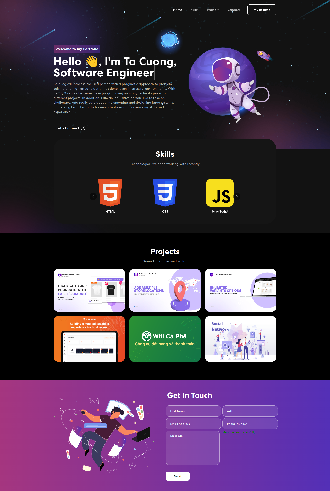

# Personal Portfolio Website



Built using:

- Frontend library: ReactJS
- Backend library: ExpressJS

You can run:

## Backend

```
cd backend && npm run dev
```

Runs the server in the development mode to receive info contact.\
Open [http://localhost:4000](http://localhost:4000) to test connection.

The server will reload when you make changes.\
You may also see any lint errors in the console.

## Frontend

```
cd frontend && npm run start
```

Runs the app in the development mode.\
Open [http://localhost:3000](http://localhost:3000) to view it in your browser.

The page will reload when you make changes.\
You may also see any lint errors in the console.
